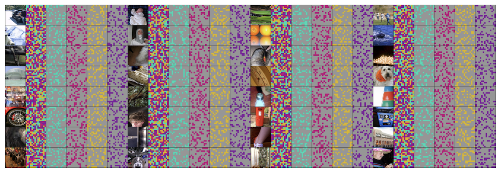

<h1>🚀Fast ConvMAE🚀</h1>
<h3>Fast ConvMAE: Fast Pretraining of ConvMAE</h3>

This repo is the faster implementation of [ConvMAE: Masked Convolution Meets Masked Autoencoders](https://arxiv.org/abs/2205.03892).

## Updates
***17/June/2022***

Released the pre-training codes for ImageNet-1K.

## Introduction
Fast ConvMAE framework is a superiorly fast masked modeling scheme via complementary masking and mixture of reconstrunctors based on the ConvMAE. 

## Pretrain on ImageNet-1K
The following table provides pretrained checkpoints and logs used in the paper.
| | Fast ConvMAE-Base|
| :---: | :---: |
| 50epoch pretrained checkpoints| N/A |
| logs | N/A |

## Main Results on COCO & ImageNet-1K
| Models | Masking | Tokenizer| Backbone | PT Epochs | PT Hours | COCO FT Epochs | $AP^{Box}$ | $AP^{Mask}$ |ImageNet Finetune Epochs | Finetune acc@1(%) | ADE 20K mIoU|
| :---: | :---: | :---: | :---: | :---: | :---: | :---: | :---: | :---: | :---: | :---: | :---: |
| ConvMAE | 25 \% | RGB | ConvViT-B | 200 | 512 | 25 | 50.8 | 45.4 | 100| 84.4 | 48.5 |
| ConvMAE | 25 \% | RGB | ConvViT-B | 1600 | 4000 | 25 | 53.2 | 47.1 | 100 | 85.0 | 51.7 |
| MAE | 25 \% | RGB | ViT-B | 1600 | 2069 | 100 | 50.3 | 44.9 | 100 | 83.6 | 48.1 |
| SimMIM | 100 \% | RGB | Swin-B | 800 | 1609 | 36 | 50.4 | 44.4 | 100 | 84.0 | - |
| GreenMIM | 25 \% | RGB | Swin-B | 800 | 887 | 36 | 50.0 | 44.1 | 100 | 85.1 | - |
| ConvMAE | 100 \% | RGB | ConvViT-B | 50 | 266 | 25 | 51.0 | 45.4 | 100 | 84.4 | 48.3 |
| ConvMAE | 100 \% | C+T |ConvViT-B | 50 | 333 | 25 | 52.8 | 46.9 | 100 | 85.0 | 52.7 |
| ConvMAE | 100 \% | C+T |ConvViT-B | 100 | 666 | 25 | 53.3 | 47.3 | 100 | 85.2 | 52.8 |
| ConvMAE | 100 \% | C+T |ConvViT-L | 200 | N/A | 25 | N/A | N/A | 50 | 86.7 | 54.5 |
## Visualizations

NOTE: Grey patches are masked and colored ones are kept.

## Getting Started
### Prerequisites
* Linux
* Python 3.7+
* CUDA 10.2+
* GCC 5+

### Training and evaluation
* See [PRETRAIN.md](PRETRAIN.md) for pretraining.

## Acknowledgement
The pretraining and finetuning of our project are based on [DeiT](https://github.com/facebookresearch/deit), [MAE](https://github.com/facebookresearch/mae), and [ConvMAE](https://github.com/Alpha-VL/ConvMAE). Thanks for their wonderful work.

## License
FastConvMAE is released under the [MIT License](https://github.com/Alpha-VL/ConvMAE/blob/main/LICENSE).

